# jplots

Draw plots directly in the kdb+/q prompt, rendered as pixels in your terminal over the
[sixel](https://rioterm.com/docs/features/sixel-protocol) or
[kitty graphics](https://sw.kovidgoyal.net/kitty/graphics-protocol/) protocol. Query, plot and
iterate without leaving q. No notebook, no browser, no export step.

```q
q)\l plt.q
q).plt.line select date, close, vwap from trade where date within (2026.01.01;2026.08.19)
```

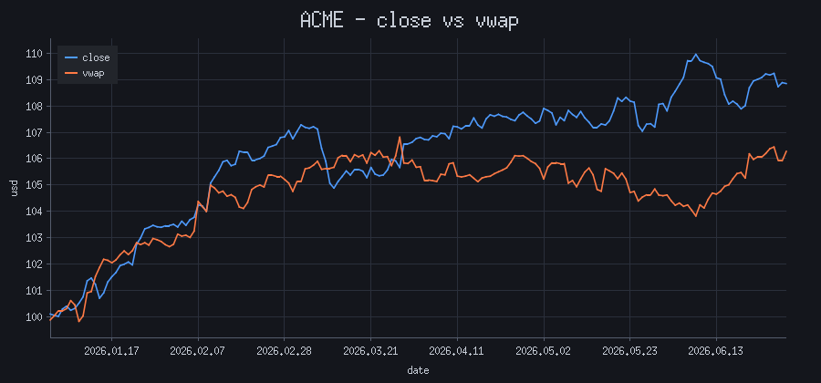

MIT licensed.

## Install

Linux x64, or macOS on Apple silicon. Build it:

```sh
make            # -> target/release/libjplots.so
make install    # -> $QHOME/l64/libjplots.so, $QHOME/plt.q, ~/.local/bin/jplots-mail
```

Or download the release tarball, which unpacks to the library, `plt.q`, `jplots-mail` and the
examples, and runs from where it lands without installing.

## Plotting

```q
.plt.line    select date, close, vwap from trade
.plt.scatter select px, size from trade
.plt.bar     select cnt:count i by sym from trade
.plt.hbar    select seconds by query, cache from bench       / one bar per row, coloured by cache
.plt.hist    exec ret from returns
.plt.candle  select time,open,high,low,close by 5 xbar time.minute from trade
.plt.by[`scatter; `sym; select sym,close,vwap from trade]   / one series per group
.plt.matrix  select AAPL, NVDA, TSLA, GOOG from rets        / NxN scatter matrix
.plt.xy[`scatter; xs; ys]                                   / explicit x/y
.plt.bands  ([data:t; style:...])                           / translucent lo/hi regions
```

| | |
| --- | --- |
| 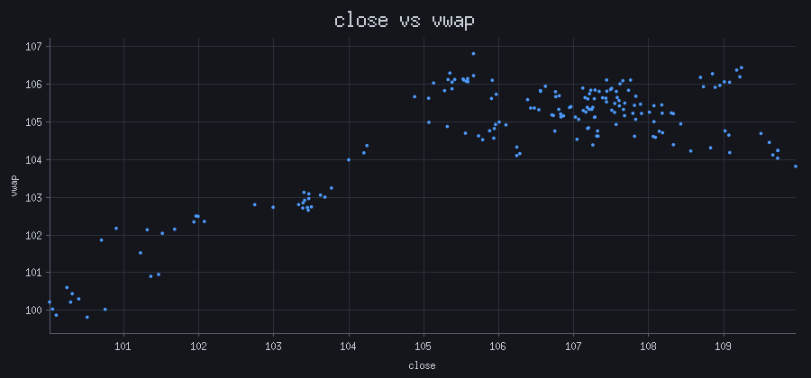 | 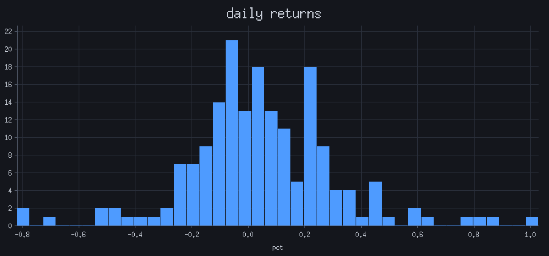 |
| `.plt.scatter select close, vwap from trade` | `.plt.hist exec ret from returns` |
| 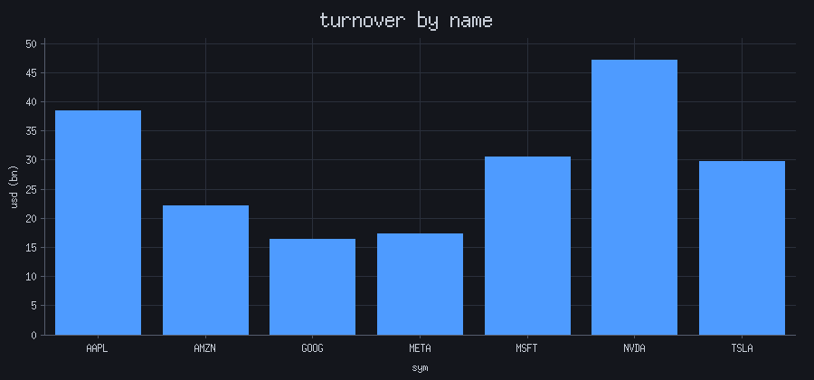 | 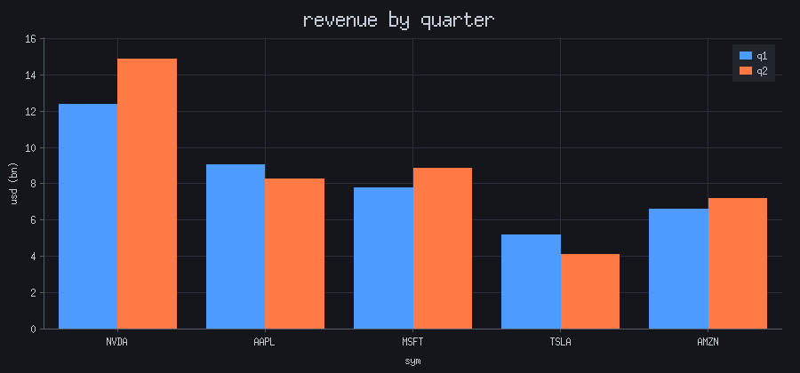 |
| `.plt.bar select last close by ticker from trade` | two value columns, side by side |
| 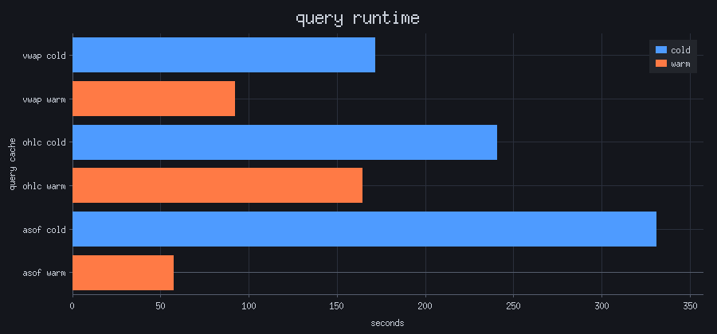 | |
| `.plt.hbar select seconds by query, cache from bench` | text columns label the row, numeric ones are the bars; keyed, the last key colours them |
| 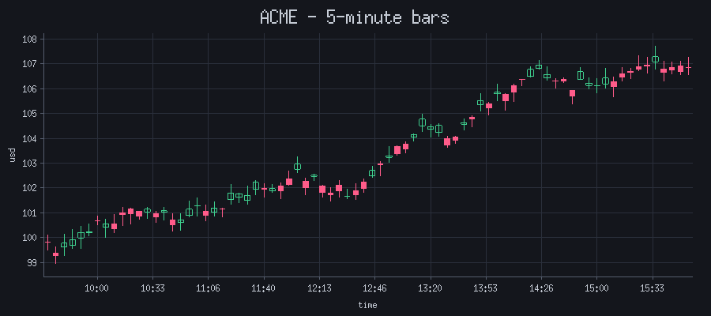 | 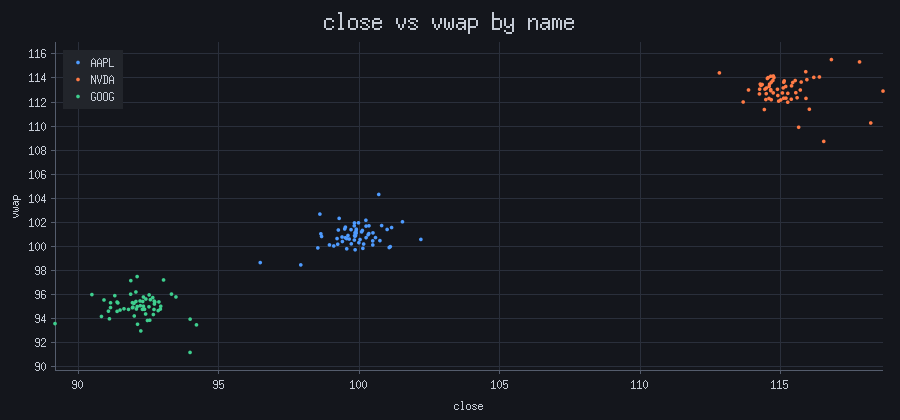 |
| `.plt.candle select open,high,low,close by 5 xbar time.minute from trade` | ``.plt.by[`scatter; `sym; t]`` |

Every entry point takes the same shapes:

| input | reading |
| --- | --- |
| table | first column is x, each remaining column is a series named after itself |
| one-column table | that column against its row index |
| keyed table | unkeyed first, so `select … by sym` plots directly |
| dict | keys are x, values are the series |
| vector | y against its row index |
| list of vectors | one series each |

Nulls are gaps, not zeros. The x axis formats itself from the column's **type**: temporals get
calendar- and clock-aware ticks, symbols and strings become categorical positions, everything
else is numeric. Axes name themselves after their columns; a single-series chart has no legend
so its y axis takes the series name.

`.plt.candle` picks its four columns out **by name**, so their order does not matter and
whatever is left over becomes the x axis.

## Fitted lines

`overlay` takes the same shapes as `data` and draws them as **lines on top** of whatever the
plot's own kind is. `.plt.fit[x;y]` is the least-squares line as a two-row table.

```q
.plt.scatter ([data:sample; overlay:.plt.fit[sample`x; sample`y]])
.plt.bar     ([data:monthly; overlay:([] i:0 11f; trend:...)])   / bar x is 0..n-1
```

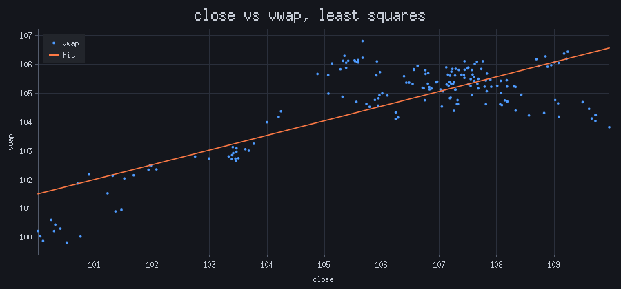

## Scatter matrix

`.plt.matrix` draws every column against every other, the diagonal a histogram, each panel a
least-squares line, and **returns the fit** keyed by ordered pair:

```q
q).plt.matrix select AAPL, NVDA, TSLA from rets
y    x   | beta      intercept   r
---------| -------------------------------
AAPL NVDA| 0.2401048 -0.07468546 0.5488665
NVDA AAPL| 1.254679  0.08075378  0.5488665
...
```

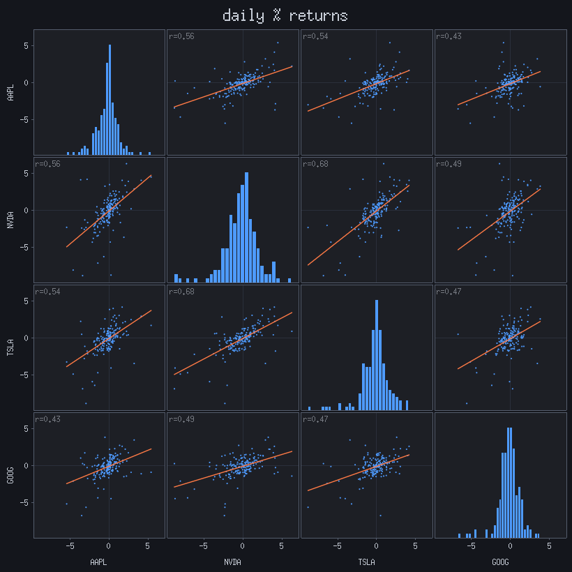

Both directions are present and differ; `r` is symmetric, which is why panels are annotated
with it. The diagonal is dropped. Every panel shares one scale, so a tight pair and a diffuse
one are comparable. Non-numeric columns are skipped. `fit_line:0b` drops the drawn lines and
leaves the table alone.

## Bands

`.plt.bands` draws a translucent region between two columns, for confidence intervals, error
bars, or a rolling standard deviation. A `style` dict says which column is what:

```q
t:update mid:20 mavg close, sd:20 mdev close from trade
t:update up:mid+2*sd, lo:mid-2*sd from t
.plt.bands ([data:t; style:([close: ([kind:`band; y:`close; lo:`lo; hi:`up])])])
```

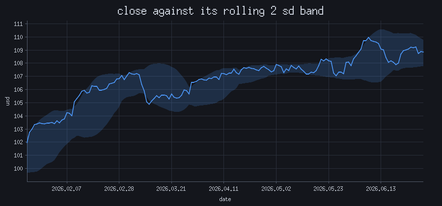

Each key of `style` is one series, named in the legend; its entry describes what to draw.

| key | |
| --- | --- |
| `kind` | `` `band `` or `` `line `` |
| `y` | the centre line, optional: a band with no `y` is just the region |
| `lo`, `hi` | the edges, both required for a band |
| `c` | colour, `"#4c9aff"` or a symbol; the palette otherwise |

Bands and lines mix in one chart, so the fitted line stays `.plt.fit`. `x` is the first column
unless an `x` key names another one. Nulls break a band into separate regions rather than
bridging them.

## Style and settings

Pass a dict of `data` plus per-call style instead of bare data:

```q
.plt.line ([title:"Price Change YTD%"; data:select last close by ticker from trade])
.plt.hist ([data:returns; bins:60; theme:`light; size:1600 800])
```

`data` is required; `title`, `xlabel`, `ylabel`, `names`, `overlay` and the settings below may
ride alongside it, for that call only. An unrecognised key signals. A dict *without* `data` is
data itself, keyed by x.

| setting | default | |
| --- | --- | --- |
| `.plt.renderer` | detected | `` `sixel `` or `` `kitty ``; see [Terminals](#terminals) |
| `.plt.theme` | `` `dark `` | `` `dark `` or `` `light `` |
| `.plt.size` | `()` | `(width;height)` in pixels; empty fits the terminal |
| `.plt.font` | `()` | integer glyph scale; empty matches the terminal's text |
| `.plt.scale` | `()` | multiplies size and font; the HiDPI escape hatch |
| `.plt.bins` | `30` | histogram bins |
| `.plt.sixel_cursor` | `` `reserve `` | `` `advance `` if plots draw over each other |

`.plt.info[]` reports what was detected and what the next plot will use. `xpix`/`ypix` of `0`
means nothing was detected and 8x16 cells were assumed; that is when plots go soft, and
`.plt.scale` or a pinned `.plt.size` is the fix.

## Terminals

Both renderers draw the same picture and differ only in the escape sequence carrying the
pixels. The default is whichever one your terminal can draw: `` `sixel `` reaches the most
terminals, except the two that implement the kitty protocol and not sixel. Both name
themselves in `$TERM`, so nothing needs setting by hand.

| | `` `sixel `` | `` `kitty `` | |
| --- | --- | --- | --- |
| Windows Terminal | yes | no | |
| xterm, foot, mlterm | yes | no | |
| Konsole, Contour | yes | yes | |
| iTerm2 | | yes | |
| kitty, ghostty | no | yes | detected from `$TERM` |
| PuTTY, MobaXterm | no | no | no pixel protocol at all |

Sixel is a 256-colour format, which matters less than it sounds: a bar or candlestick chart
uses five to seven colours, and on the busiest chart here the top 256 cover 99.2% of pixels.
On the wire it beats kitty for flat charts (a 900x420 bar chart is 7 KB against 22 KB).

**If charts stop appearing, check the window height first.** A 900x420 chart is about fourteen
rows, so ten of them need a 140-row window; the rest scroll away, and whether you can scroll
back to them is the terminal's business.

## Reports by email

`jplots-mail` turns a captured session into a message: text runs become `<pre>` blocks, plots
become PNG parts, and the order is kept, so a report reads as it did in the terminal.

```sh
q examples/report.q | jplots-mail | sendmail -t
```

It reads bytes, so **any command works**, not only q. The sending script names its own headers
by printing lines that are lifted out of the body:

```q
-1 "EMAIL-TO: ops@example.com";
-1 "EMAIL-SUBJECT: ",$[errs; "[BAD] ",string[errs]," failures"; "[OK] daily quality"];
```

`TO`, `FROM`, `SUBJECT`, `CC`, `BCC` and `REPLY-TO` are recognised. Images go out as `cid:`
parts in a `multipart/related` message, which is what Outlook will load; `--data-uri` gives one
self-contained file instead. `--template FILE` takes a Jinja2 body template, `--title` sets a
heading, `--html` emits the body with no message headers.

Either renderer works: the charts are decoded back to pixels, so the protocol they arrived in
does not survive into the message. Pin `.plt.size` and use `.plt.theme:`` `light ``, since a
redirected stdout has no terminal to measure and mail is read on white.

## How it works

```text
q          plt.q builds ONE spec dict from a table/dict/vector
  |
kapi.rs    K -> Plot          (kdb+ through 2:, or a Rust host directly)
  |
layout.rs  ticks, margins, legend, panels -> device coordinates
  |
Canvas     line / rect / polygon / marker / text
  |
raster.rs  RGB pixels -> sixel.rs or kitty.rs -> escapes -> stdout
                         -> png.rs -> jplots-mail -> an email
```

Everything expensive to get right (tick selection, the calendar, label formatting, margins,
legend placement) lives above the `Canvas` trait, so a new backend inherits it. `text` is a
semantic call rather than a blit, so an SVG backend can emit a real `<text>` element.

**Argument munging stays in q.** `plt.q` reads a table's shape in a few lines that would be
fifty of Rust, and the API can change without rebuilding the library.

**No dependency tree.** `base64`, `flate2` and `libc` are the whole list, and `jplots-mail`
adds a template engine behind the `mail` feature. Pixels go out as zlib-compressed RGB, so
there is no PNG encoder, and glyphs come from a 6x13 bitmap table generated from the
public-domain X11 `misc-fixed` font.

## Development

```sh
make test      # cargo tests, then tests/test.q under kdb+
make demo      # every chart type, on sample data; name a renderer to force one
make images    # regenerate docs/img/ from the examples
```

Everything generated lands under `target/`; the repo root stays source-only. To run a q script
against a development build:

```sh
JPLOTS_LIB=$PWD/target/release/libjplots q examples/demo.q -q
```

### When a terminal will not draw it

`jplots-probe` sends the same test pattern several ways, changing one piece of the protocol at
a time, so the frames that appear name what the terminal rejects. Each carries a ruler, colour
bands, corner markers and a 1px checkerboard that goes flat grey if the image is being
rescaled.

```sh
cargo run --release --bin jplots-probe            # five kitty variants
cargo run --release --bin jplots-probe -- --sixel # one sixel frame
cargo run --release --bin jplots-probe -- --cursor  # one frame per .plt.sixel_cursor value
cargo run --release --bin jplots-probe -- --palette # 4..256 colours, to find a palette limit
```

`-n 3` sends one variant, `-s 400x240` changes the size, `--raw` writes just the bytes. It
drives the same encoder the library does, so a variant that works here works in a plot.

### Looking at what was actually sent

`utils/decode.py` and `utils/desixel.py` reverse the wire format back to PNG, so a rendering
change is reviewed from a real q run rather than a re-render that might differ:

```sh
q examples/demo.q -q kitty > out.esc && utils/decode.py out.esc frame
```